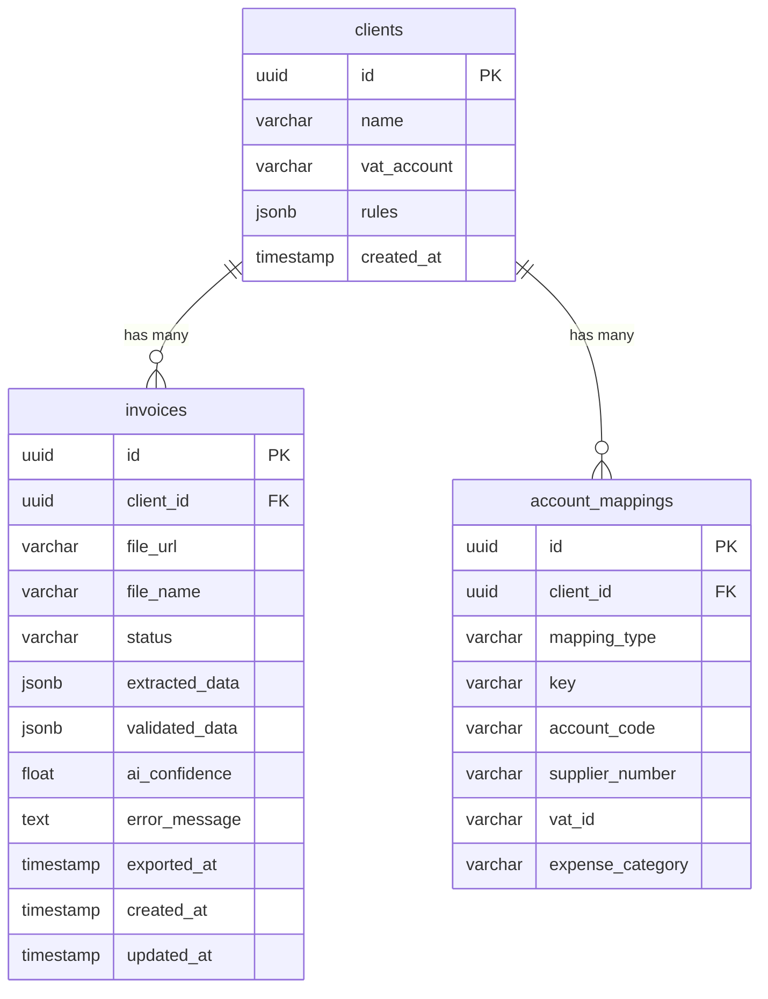

# Database Schema (Supabase / PostgreSQL)

This document outlines the database tables, relationships, and JSONB field schemas used in the Invoice Scan application.

---

## 📊 Entity Relationship Diagram (Conceptual)


---

## 📁 Tables Reference

### 1. `clients`
Contains client (tenant) data and processing rule overrides.

| Column Name | Data Type | Nullable | Description |
| :--- | :--- | :--- | :--- |
| `id` | `uuid` | No | Primary Key. Unique client identifier. |
| `name` | `varchar` | No | Name of the client company. |
| `vat_account` | `varchar` | No | Bookkeeper VAT account code for this client. |
| `rules` | `jsonb` | Yes | Custom rules for validation. Matches the `TenantRules` schema. |
| `created_at` | `timestamp` | No | Record creation timestamp. |

#### `rules` JSONB Schema (`TenantRules`):
```json
{
  "maxAmountForAutoApprove": 1000,
  "requireVatId": true,
  "requireInvoiceDate": true,
  "requireExpenseCategory": true,
  "allowedExpenseCategories": [
    "ציוד משרדי",
    "שכ\"ד",
    "תקשורת",
    "שיווק ופרסום",
    "נסיעות",
    "אחזקה",
    "שירותים מקצועיים",
    "חשמל ומים",
    "אחר"
  ],
  "duplicateInvoiceCheck": true
}
```

---

### 2. `invoices`
Stores invoices and the results of their OCR, LLM extraction, and validation stages.

| Column Name | Data Type | Nullable | Description |
| :--- | :--- | :--- | :--- |
| `id` | `uuid` | No | Primary Key. Unique invoice identifier. |
| `client_id` | `uuid` | No | Foreign Key referencing `clients.id`. |
| `file_url` | `varchar` | No | Signed URL pointing to the raw file in storage. |
| `file_name` | `varchar` | No | Original name of the uploaded file. |
| `status` | `varchar` | No | Current pipeline status: `processing`, `review`, `approved`, `exported`, `error`, `rejected`. |
| `extracted_data` | `jsonb` | Yes | Raw data extracted by Claude. Matches `ExtractedData` schema. |
| `validated_data` | `jsonb` | Yes | Data verified/modified by business rules or humans. |
| `ai_confidence` | `float` | Yes | Calculated confidence score between `0.1` and `1.0`. |
| `error_message` | `text` | Yes | Details of errors if pipeline fails or crashes. |
| `exported_at` | `timestamp` | Yes | Timestamp when the invoice was successfully exported. |
| `created_at` | `timestamp` | No | Record creation timestamp. |
| `updated_at` | `timestamp` | No | Record modification timestamp. |

#### `extracted_data` / `validated_data` JSONB Schema (`ExtractedData`):
```json
{
  "supplier_name": "string or null",
  "supplier_vat_id": "string (9 digits) or null",
  "invoice_number": "string or null",
  "invoice_date": "string (YYYY-MM-DD) or null",
  "amount_before_vat": 120.50,
  "vat_amount": 20.50,
  "total_amount": 141.00,
  "expense_category": "string or null",
  "bank_name": "string or null",
  "bank_branch_code": "string or null",
  "bank_branch_name": "string or null",
  "bank_account": "string or null",
  "validation_flags": {
    "math_ok": true,
    "vat_id_ok": true,
    "fields_missing": ["string"],
    "duplicate_found": false,
    "rule_violations": ["string"],
    "warnings": ["string"],
    "requires_manual_review": true,
    "not_an_invoice": false
  },
  "bboxes": {
    "supplier_name": { "x1": 0.1, "y1": 0.1, "x2": 0.2, "y2": 0.15 }
  }
}
```

---

### 3. `account_mappings`
Stores ERP account mappings mapped against suppliers and categories for specific clients.

| Column Name | Data Type | Nullable | Description |
| :--- | :--- | :--- | :--- |
| `id` | `uuid` | No | Primary Key. |
| `client_id` | `uuid` | No | Foreign Key referencing `clients.id`. |
| `mapping_type` | `varchar` | No | Type of mapping: `supplier` or `category`. |
| `key` | `varchar` | No | The search key (e.g. supplier name "חברת דלק" or category "נסיעות"). |
| `account_code` | `varchar` | No | Bookkeeping code in ERP (e.g. "3044", "3499"). |
| `supplier_number` | `varchar` | Yes | ERP-specific supplier registration number. |
| `vat_id` | `varchar` | Yes | The supplier's verified Israeli VAT ID (H.P.). |
| `expense_category`| `varchar` | Yes | Mapping reference code if categorizing. |
